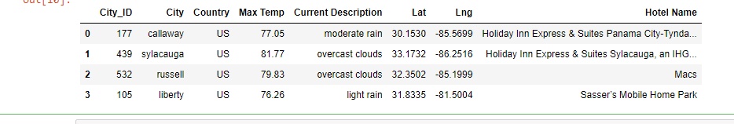

# World Weather Analysis

## Overview
  - The task I was given this week involved using API's with Google and Open Weather Map to gather data for weather across the world and locally. With Google I was able to find efficient routes for a roadtrip/vacation including hotel accommodation.
  
## Results
  - While putting the code together and gathering the data I found suitable spots in the southern region of the United States with nice enough weather and good hotel accommodations for every stop of the trip. Below I have an example of the map working in the code showing the stops and information going along with the hotel stay. 

## Conclusion

  - In conclusion while this project was much shorter and to the point than previous weeks I still felt like it was a bit of a challenge. For example fine tuning the code to show figures with different cities and having additional information shown once clicked on/ interacted with. I feel that this week I was still able to show my skills and give the customer what they were asking for in the end.
